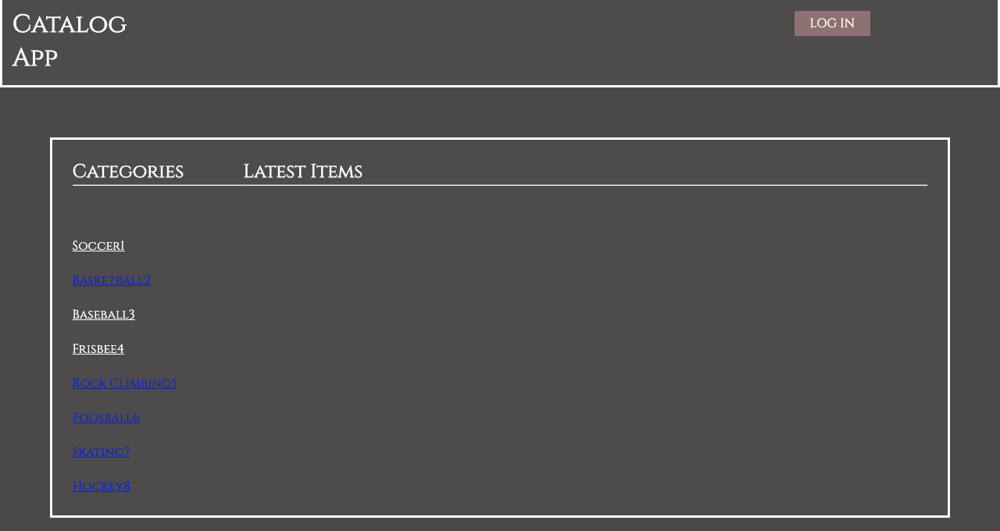

# Catalog Project

This App was built using Python3, Flask and SQLAlchemy. The app suppor Google Autentication and only registed users can edit and delate their own itmes. People who is not registed will be allow to see the items but not create, edit or delate.

# Run The Project
## Set Up First

1. Install [Vagrant](https://www.vagrantup.com)
2. Install [VrtualBox](https://www.virtualbox.org/)
3. Get [Vagrant Set Up](https://github.com/udacity/fullstack-nanodegree-vm)
7. Take the files into vagrant folder.
8. Run ``vagrant up`` to build th Virtual Machine
9. Run ``vagrant ssh`` to connect.
10. cd into the ```cd /vagrant/Catalog```.
11. Install  ```python3 -m pip install --upgrade flask```.
12. Run ``` python database_setup.py ``` to create the Database.
13. Run ``` python populateDB.py ``` to populate the Database.


## Erros running Vagrant?

Take a look in [Udacity's FAQ](https://classroom.udacity.com/nanodegrees/nd004/parts/8d3e23e1-9ab6-47eb-b4f3-d5dc7ef27bf0/modules/bc51d967-cb21-46f4-90ea-caf73439dc59/lessons/262a84d7-86dc-487d-98f9-648aa7ca5a0f/concepts/a9cf98c8-0325-4c68-b972-58d5957f1a91)

## Technologies

1. [PYTHON3](https://www.python.org/download/releases/3.0/): Follow the style conventions in PEP 8. thought pycodestyle.
2. [FLASK](https://www.palletsprojects.com/p/flask/): Acording to palletsprojects.com: Flask is a lightweight WSGI web application framework. It is designed to make  getting started quick and easy, with the ability to scale up to complex applications. It began as a simple wrapper around Werkzeug and Jinja and has become one of the most popular Python web application frameworks.
3. [PostgreSQL](https://www.postgresql.org/): It is one of the most advanced relational DataBase.
4. [sqlalchemy](https://www.sqlalchemy.org/): Is a python SQL toolkit giving the power of flexibility of SQL
5. [Google Authentication](https://developers.google.com/maps/documentation/javascript/get-api-key?hl=es-419): Users can edit and delete their own products and not the other users. This feature was possible integrating Google API to create the new user with an existed google account.


## Ready to RUN!
1. run ```python project.py```
2. Go to ```http://localhost:5000/``` in your favorite browser.
3. You should get this 




